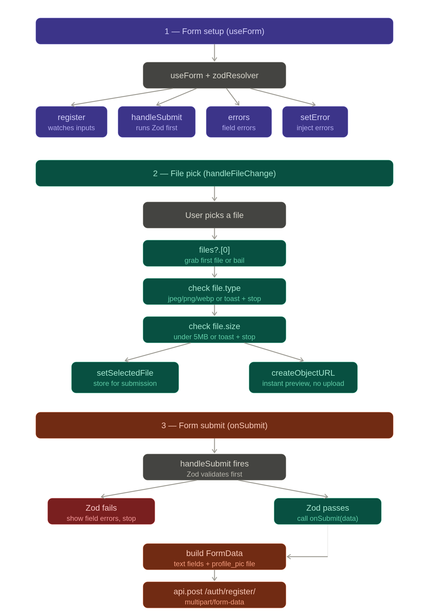
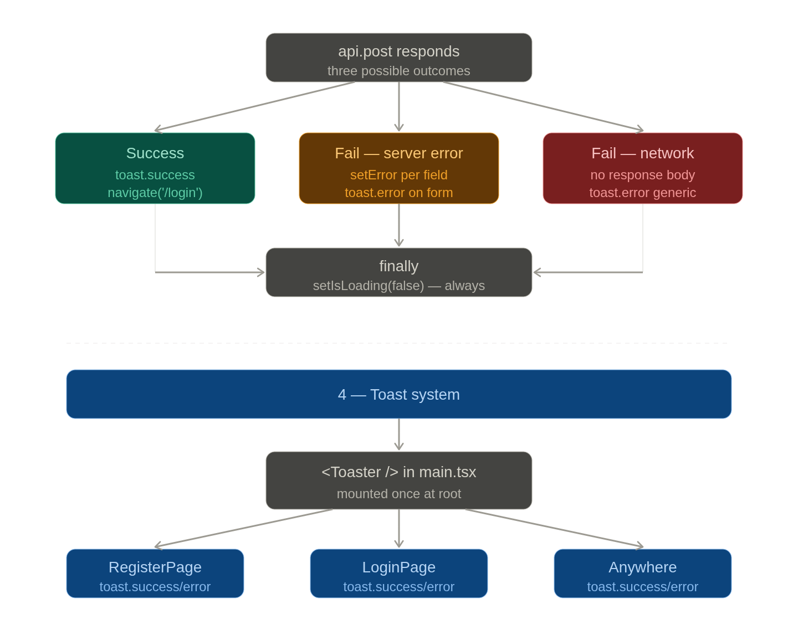

# Auth Module — Jury Preparation Guide
### FundEgypt (OasisFund) — Dev 1 — Authentication

---

# PART 0 — SYSTEM OVERVIEW

## The Full Journey: Register → Activate → Login → Authenticated Requests

Here is what happens in plain English from the first click to the first protected API call.

**Step 1 — Registration**
The user fills out the register form in React. Before the data even leaves the browser, Zod validates it — checking email format, password length (min 8), Egyptian phone format (`01[0125]XXXXXXXX`), and that password and confirm_password match. React Hook Form manages the form state and connects to Zod via `zodResolver`. Only when everything passes locally does the form submit.

The frontend sends a `multipart/form-data` POST to `/api/auth/register/`. The backend's `RegisterSerializer` validates the data again (server-side — never trust the client alone). It checks the password match, hashes the password using `create_user()` which calls Django's `set_password()`, stores the profile picture via Cloudinary, and saves the user with `is_activated = False`.

**Step 2 — Activation Email**
Immediately after saving, `send_activation_email()` is called. A `TimestampSigner` with `salt='activation'` signs the user's primary key to produce a token. The token is URL-encoded with `quote()` and embedded into a link pointing to the React frontend (`FRONTEND_URL/activate/<token>`). The email is sent via Brevo SMTP. The `last_activation_sent` timestamp is saved to support the resend cooldown.

**Step 3 — Account Activation**
The user clicks the link. React's `ActivatePage` reads the token from the URL params and sends a GET to `/api/auth/activate/<token>/`. The backend URL-decodes the token, then calls `signer.unsign(token, max_age=86400)` — this both verifies the cryptographic signature AND checks that the token is less than 24 hours old. If valid, the user's `is_activated` flag is set to `True` and `joined_at` is recorded. The page shows one of five distinct states: loading, success, already, expired, or invalid.

**Step 4 — Login**
The user submits email and password to `/api/auth/login/`. The `LoginSerializer` calls Django's built-in `authenticate()` — which handles the password hash comparison securely. If the credentials are correct but the account is not activated, the response includes `not_activated: True` so React knows to show a resend button. If everything is valid, `LoginView` generates a JWT pair using `RefreshToken.for_user(user)` from SimpleJWT. Both the access token (30 min) and refresh token (7 days) are set as httpOnly cookies in the response — they never touch JavaScript.

**Step 5 — Session Restoration**
Immediately after login, React calls GET `/api/auth/me/` to retrieve the user's data and stores it in Redux (`isAuthenticated: true`, `user: {...}`). On every app load, `checkAuth` thunk fires, hits `/auth/me/`, and if the cookie is still valid, Redux is populated. If not, the user is treated as logged out.

**Step 6 — Authenticated Requests**
Every request goes through the Axios instance in `client.ts`, which has `withCredentials: true` — so the browser automatically attaches the httpOnly access cookie. The backend reads it via the custom `CookieJWTAuthentication` class. If the access token is expired, the backend returns 401. Axios intercepts that 401, silently calls `/auth/token/refresh/` (which reads the refresh cookie), gets a new access cookie, and retries the original request — all without the user knowing.

**Step 7 — Logout**
The user clicks logout. The Redux `logout` thunk calls POST `/api/auth/logout/`. The backend reads the refresh token from the cookie, blacklists it using SimpleJWT's blacklist table (so it can never be reused), then deletes both cookies from the response. Redux state is cleared regardless of whether the API call succeeds.

---

## The Six Main Blocks

### 1. User Model (`models.py`)
A fully custom user model extending `AbstractBaseUser` and `PermissionsMixin`, using email as the login identifier instead of username. It includes Egyptian phone validation, a role field, an `is_activated` flag that gates login, and a `last_activation_sent` timestamp for resend cooldown. This exists because Django's default User model uses username-based auth and lacks the domain-specific fields the platform needs (phone, activation, role).

### 2. Activation System (`utils.py`, `views.py`)
Uses Django's `TimestampSigner` to produce a cryptographically signed, time-limited token containing the user's PK. No database table is needed — the signature itself proves authenticity and the timestamp proves freshness. This exists to prevent account spam and ensure every registered user controls the email they provided.

### 3. Login and Logout (`views.py`, `serializers.py`)
Login validates credentials via Django's `authenticate()`, then issues JWT tokens as httpOnly cookies. Logout blacklists the refresh token and clears both cookies. This two-step invalidation (blacklist + cookie deletion) ensures that even if someone had copied the refresh token, it cannot be reused after logout.

### 4. Token Infrastructure (`authentication.py`, `settings.py`, `client.ts`)
A custom `CookieJWTAuthentication` class reads the access token from cookies instead of the Authorization header. SimpleJWT handles token generation, validation, and blacklisting. The Axios interceptor handles silent refresh on the frontend. This block exists to give the security of httpOnly cookies while keeping the stateless nature of JWT.

### 5. Frontend Auth State (`authSlice.ts`, `store.ts`)
Redux Toolkit manages three pieces of state: `user`, `isAuthenticated`, and `isLoading`. `isLoading` starts as `true` so that `ProtectedRoute` does not flash a redirect before the session check completes. Two async thunks (`checkAuth` and `logout`) handle the side effects. This exists to give every component in the app a single, consistent source of truth about who is logged in.

### 6. Protected Routes (`ProtectedRoute.tsx`)
A wrapper component that reads from Redux. If loading, it shows a spinner. If not authenticated, it redirects to `/login`. If authenticated, it renders `<Outlet />` — the child routes. This exists to prevent unauthenticated users from accessing any page that requires a valid session, without repeating auth checks in every component.

---

# PART 1 — JURY QUESTIONS AND IDEAL ANSWERS

---

## User Model Design

**Q: Why did you extend `AbstractBaseUser` instead of just using Django's default User model or extending `AbstractUser`?**

The default User model uses username as the login field. We needed email-based login, which means setting `USERNAME_FIELD = 'email'`. `AbstractUser` also has a `username` field that we would not use — it creates noise and potential confusion. `AbstractBaseUser` gives us a clean slate where we define exactly what fields exist and how authentication works. The tradeoff is that we have to write more code — a custom `UserManager` with `create_user` and `create_superuser` — but it gives us full control with no unused baggage.

**Q: Why do you need a custom `UserManager`?**

Django's built-in manager assumes the `USERNAME_FIELD` is `username`. Since we changed it to `email`, the manager must be updated to understand that. `create_user` normalizes the email (lowercases the domain part to prevent duplicate accounts like `Ahmed@Gmail.com` and `ahmed@gmail.com`), hashes the password using `set_password()`, and saves the user. `create_superuser` sets `is_staff`, `is_superuser`, `is_activated`, and `role` to the correct values for an admin account.

**Q: Why does `is_activated` default to `False`?**

Every new user is unverified until they click the activation link in their email. This ensures that the email address in our database is real and belongs to the person who registered. Without this, anyone could register with someone else's email, and that person would start receiving platform notifications they never requested. It also prevents bots from immediately using disposable email addresses to flood the platform.

**Q: Why did you keep `is_staff` on the model if this is a JWT-based API?**

`is_staff` is specifically for Django's admin panel (`/admin/`). The admin panel uses session-based auth internally and checks `is_staff` to decide who can log in. We kept it because superusers need to access Django admin for data management during development and maintenance. It has no impact on the API authentication at all — the API uses `role` for application-level permissions.

**Q: What does `PermissionsMixin` add?**

It adds `is_superuser` and the many-to-many relationships with `Group` and `Permission` models. This is what makes Django's built-in permission system work — things like `user.has_perm('app.change_model')`. We include it so that Django admin and DRF's permission classes function correctly without having to reimplement the entire permission infrastructure.

**Q: Why validate the phone number with a regex on the model?**

Because model-level validation is the last line of defense before data reaches the database. The regex `^01[0125][0-9]{8}$` enforces Egyptian mobile network prefixes (Vodafone: 010, Orange: 012, Etisalat: 011, WE: 015) followed by exactly 8 digits — making 11 digits total. The same regex is mirrored on the frontend in Zod, so the user gets immediate feedback in the browser, but the backend check means the rule holds even if someone calls the API directly without using the frontend.

---

## Authentication Strategy

**Q: Why JWT instead of Django's built-in session authentication?**

Sessions require server-side storage — every session must be kept in the database or cache. With JWT, the token itself carries the user's identity and the server just verifies the signature — no lookup needed. This scales better horizontally because any server instance can validate any token without shared session storage. It also naturally supports a React SPA that talks to a separate Django API on a different domain. The tradeoff is that tokens cannot be truly "revoked" mid-lifetime, which is why we use short-lived access tokens (30 minutes) and a blacklist for refresh tokens.

**Q: Why did you use `djangorestframework-simplejwt` and not write your own JWT logic?**

Because JWT implementation has many subtle security requirements — correct algorithm selection, signature verification, expiry handling, token structure. SimpleJWT is a well-audited library maintained specifically for DRF. Writing our own would be reinventing the wheel and introducing potential vulnerabilities. We only extended it by adding the cookie-reading layer on top, which is the domain-specific piece that the library doesn't handle out of the box.

**Q: Why is `ROTATE_REFRESH_TOKENS` set to `True`?**

Every time the user's access token expires and is refreshed, the old refresh token is replaced with a new one and the old one is blacklisted. This is called refresh token rotation. The security benefit is that if an attacker steals a refresh token and tries to use it after the legitimate user has already used it once, the stolen token will already be blacklisted. Without rotation, a stolen refresh token would be valid for its entire 7-day lifetime.

---

## Token Storage

**Q: Why store tokens in httpOnly cookies instead of localStorage?**

localStorage is accessible by any JavaScript running on the page. If the site has a Cross-Site Scripting (XSS) vulnerability, an attacker's injected script can read `localStorage` and steal the tokens. httpOnly cookies cannot be read by JavaScript at all — the browser stores them and sends them automatically, but no script can access their value. This is the industry-standard approach for securing tokens in browser-based applications.

**Q: Doesn't using cookies introduce CSRF risk?**

Yes, cookies are automatically sent by the browser with every request, which is the attack surface for CSRF. We mitigate this in two ways. First, `CORS_ALLOW_CREDENTIALS = True` combined with specific `CORS_ALLOWED_ORIGINS` means the browser will only send cookies to our known domains, not to arbitrary third-party sites. Second, `SameSite=Lax` in development means cookies are not sent on cross-site requests initiated by third-party pages. In production we use `SameSite=None` (required for cross-origin with credentials) combined with `Secure=True` (HTTPS only) and the CORS whitelist as the control layer.

**Q: Why `SameSite=Lax` in development and `SameSite=None` in production?**

In development, frontend and backend run on the same machine (localhost), so `Lax` is fine and avoids needing HTTPS. In production, the React frontend is on `crowdfund.duckdns.org` and the Django API may be on a different subdomain or port, making them technically cross-origin. `SameSite=None` is required for cookies to be sent in cross-origin requests. But `SameSite=None` requires `Secure=True`, which requires HTTPS — and we use HTTPS in production.

---

## Activation Token

**Q: Why did you use Django's `TimestampSigner` and not a random UUID stored in the database?**

Two reasons. First, `TimestampSigner` is stateless — no database table, no extra migration, no cleanup job for expired tokens. The signature itself proves the token is genuine and the timestamp is embedded so `max_age` enforcement is automatic. Second, it uses Django's `SECRET_KEY` for signing, which means the token is cryptographically tied to our application. A UUID approach would require storing the token in the database, querying it on activation, and running a cleanup job to delete old ones. The signer approach is simpler and has fewer moving parts to break.

**Q: What does the token actually look like and how does it work?**

The signer produces a string in the format `user_pk:timestamp:signature` — for example `1:1wD4jp:XKn0yqgvM9TThATEAXHxYdzJDl7`. The user PK is the value being signed. The timestamp is encoded in base62. The signature is an HMAC using Django's SECRET_KEY and the `'activation'` salt. When we call `unsign(token, max_age=86400)`, Django splits the string, verifies the HMAC, then checks that the embedded timestamp is less than 86400 seconds (24 hours) ago. We URL-encode it with `quote()` before putting it in the email link so characters like `:` don't get mangled by email clients or URL parsers.

**Q: Why use a `salt` of `'activation'`?**

The salt scopes the signer so that a token generated for one purpose cannot be used for another. Without a salt, if we later added a password-reset signer using the same `TimestampSigner`, someone could theoretically use an activation token as a password-reset token. The salt makes tokens from different signers incompatible even if they sign the same value.

**Q: What happens if someone requests activation for a non-existent PK?**

The `signer.unsign()` will succeed (because the signature is valid for any value we signed), and then we do `User.objects.get(pk=user_pk)`. If no user exists with that PK, we catch `User.DoesNotExist` and return 404. This can only happen if someone had a valid token for a user that was later deleted — it's an edge case but we handle it cleanly.

---

## Login and Logout Flow

**Q: Why does credential checking happen in the serializer instead of the view?**

Serializers in DRF are the validation layer — they are the right place for input-dependent logic like "does this email and password combination work." Moving it to the view would mix concerns — views should handle HTTP mechanics (response codes, cookie setting) not business logic. The serializer validates, produces a `user` object in `validated_data`, and the view just reads it and sets cookies. This makes each layer testable independently.

**Q: Why does `LoginSerializer` call `authenticate()` and not check the password manually?**

Django's `authenticate()` runs all configured authentication backends, handles password hashing comparison internally, and handles edge cases like inactive users. Writing `user.check_password(password)` directly would bypass the authentication backend chain and could miss things like rate limiting backends or future backends we might add. It's also the established Django pattern — don't re-implement what the framework already handles correctly.

**Q: Why does logout work even if the access token is expired?**

Because `LogoutView` has both `permission_classes = []` and `authentication_classes = []`. If logout required a valid access token, a user whose access token just expired could not log out — they'd be stuck in a broken state. They'd need to wait for the interceptor to refresh the token before logout would work. Making logout completely open means any user, authenticated or not, can call it. We still blacklist the refresh token if it's valid. If the token is already expired, we catch `TokenError` and continue — the cookies are cleared regardless.

**Q: Is it a security risk that logout is a completely open endpoint?**

The risk is minimal in practice. The only harmful thing someone could do by calling logout on someone else is to clear their cookies — which just logs them out. That requires knowing the other person's refresh token (which is httpOnly and inaccessible to JavaScript), or having access to their browser. If someone has that level of access, you have bigger problems. The open logout is a deliberate UX choice — always let users log out, regardless of token state.

---

## Token Refresh and Silent Re-authentication

**Q: Walk me through exactly what happens when the access token expires mid-session.**

The user makes a request. The browser sends the expired access cookie. The backend's `CookieJWTAuthentication` calls `get_validated_token()`, catches `InvalidToken`, and returns `None` — meaning "I don't know who this is." The view has `IsAuthenticated` permission, so it returns 401. Axios intercepts the 401. It checks `originalRequest._retry` — if false, it sets it to true (the retry flag) and calls POST `/auth/token/refresh/`. The backend reads the refresh cookie, validates it, rotates it (issues a new refresh cookie), and returns a new access cookie. Axios retries the original request with the new cookie attached. The user never sees any of this.

**Q: What is the `_retry` flag for?**

It prevents an infinite loop. If the refresh itself fails (returns 401), the interceptor would normally see a 401 and try to refresh again — and again — forever. The `_retry` flag marks the original request so that if it fails after one refresh attempt, we give up and redirect to login instead of retrying. We also check `originalRequest.url?.includes('/auth/token/refresh/')` specifically to catch the case where the refresh request itself returns a 401.

**Q: Why does `CookieJWTAuthentication` return `None` on an invalid token instead of raising an exception?**

Returning `None` means "unauthenticated" — DRF will then check the view's `permission_classes`. If the view allows anonymous access (like `AllowAny`), it proceeds. If the view requires authentication (like `IsAuthenticated`), DRF raises a 401. This is the correct DRF pattern — the authentication class's job is to identify who is making the request, not to enforce access control. By returning `None` instead of raising, we let the permission system do its job rather than short-circuiting it.

**Q: Why does `CookieTokenRefreshView` not rotate the refresh token?**

This is worth looking at carefully. The `ROTATE_REFRESH_TOKENS` setting applies to SimpleJWT's built-in `TokenRefreshView`. Our custom `CookieTokenRefreshView` calls `RefreshToken(token).access_token` — it reads from the existing refresh token to generate a new access token, but does not explicitly call the rotation logic. This means our custom view does not rotate. This is actually a weak point — ideally we should also issue a new refresh cookie in the response. As implemented, the refresh token stays the same until it expires.

---

## CORS and Cookie Security

**Q: Why is `CORS_ALLOW_CREDENTIALS = True` necessary?**

By default, browsers do not send cookies or Authorization headers in cross-origin requests. This flag tells the browser that the server explicitly allows credentials. Without it, `withCredentials: true` in Axios would be ignored and cookies would never be sent. The browser enforces this as a two-way agreement — the client sets `withCredentials`, the server sets `Access-Control-Allow-Credentials: true`, and only then does the browser attach cookies.

**Q: Why do you have `CORS_ALLOWED_ORIGINS` defined twice in settings.py?**

This is a real bug. The first definition reads from `FRONTEND_URL` via `python-decouple`. The second definition overwrites it with a hardcoded list. In practice only the second definition is used. The first definition has no effect because it's overwritten before Django uses it. In production this could be an issue if `FRONTEND_URL` in the environment is different from the hardcoded list.

**Q: Why is `AUTH_COOKIE_DOMAIN` set to `.duckdns.org` in production?**

The leading dot means the cookie is valid for all subdomains of `duckdns.org`. So if the API is on `api.duckdns.org` and the frontend is on `crowdfund.duckdns.org`, the cookie set by the API is accessible by both. Without the leading dot, the cookie would only be sent back to the exact domain that set it, which could break cross-subdomain authentication.

---

## Cloudinary and Profile Pictures

**Q: Why Cloudinary instead of storing images on the server?**

The application runs on EC2. Storing images on the EC2 filesystem is fragile — if the instance is replaced or scaled, images are lost. Cloudinary is a CDN-backed image hosting service that handles storage, delivery, and on-the-fly transformation. The `django-cloudinary-storage` package integrates it as Django's default media backend, so `ImageField` works exactly as normal but files go to Cloudinary automatically.

**Q: What does `get_uploaded_image_url()` in the serializer do?**

After the image is uploaded, Cloudinary stores it and gives it a public ID (the file name). The method calls `cloudinary.CloudinaryImage(obj.profile_pic.name).build_url()` with transformation parameters: 300×300 pixels, `crop='fill'` (centered crop, no distortion), `quality='auto'` (Cloudinary picks the best quality-to-size ratio), `fetch_format='auto'` (serves WebP to browsers that support it, JPEG to others), and `secure=True` (HTTPS URL). This means every profile picture is consistently sized and optimized without us writing any image processing code.

**Q: Why is `upload_to='project/'` a weak point?**

All profile pictures go into a single flat folder called `project/` in Cloudinary. If two users upload a file with the same name, there could be collisions. A better approach would be `upload_to='users/<user_id>/'` or using a callable to generate unique paths. It works in practice because Cloudinary typically appends a unique ID, but it's not intentional design.

---

## Redux Auth State Management

**Q: Why does `isLoading` start as `true`?**

When the app first loads, we don't know if the user is logged in. We call `checkAuth` which hits `/auth/me/`. Until that call completes, `isLoading` is `true`. `ProtectedRoute` shows a spinner during this time. If we started with `isLoading: false` and `isAuthenticated: false`, every protected page would flash a redirect to `/login` for a fraction of a second before the check completed — a bad user experience and potentially a bug if components try to render before state is ready.

**Q: Why are there two ways to set auth state — `checkAuth` thunk and `setCredentials` action?**

`checkAuth` is used on app load — it checks the server to see if the session cookie is still valid. `setCredentials` is used right after a successful login — at that point we already have the user data from `/auth/me/` so there's no reason to dispatch another async thunk. Using `setCredentials` immediately after login makes the UI update synchronously and avoids a second round-trip. They serve different moments in the user journey.

**Q: Why does `logout` clear state even if the API call fails?**

If the API call fails (network error, server down), the user still expects to be logged out from the frontend's perspective. Keeping `isAuthenticated: true` when the user clicked logout would be wrong. The cookies will eventually expire naturally. The goal of logout is to end the user's session in their browser — clearing Redux state achieves that regardless of what the server does.

---

## Zod Validation and React Hook Form

**Q: Why use Zod instead of writing custom validation functions?**

Zod provides a declarative, composable schema that doubles as a TypeScript type via `z.infer<typeof schema>`. This means the `RegisterFormData` type is automatically derived from the schema — they can never drift apart. Writing custom validation manually would require maintaining both the validation logic and the TypeScript types separately. Zod also has excellent error messages and supports complex cross-field validation via `.refine()`.

**Q: How does React Hook Form connect to Zod?**

Through `zodResolver` from `@hookform/resolvers/zod`. When you pass `resolver: zodResolver(registerSchema)` to `useForm`, React Hook Form delegates all validation to Zod. On submit (and optionally on change/blur), RHF calls the resolver, which runs the Zod schema, and maps Zod errors back to RHF's error format so they display under the correct fields.

**Q: Why does the register form use `FormData` instead of JSON?**

Because it includes a file upload (profile picture). `application/json` cannot carry binary file data. `multipart/form-data` is the standard format for forms that include files. The backend `RegisterView` declares `parser_classes = (MultiPartParser, FormParser)` specifically to handle this format. The Axios call overrides the Content-Type to `multipart/form-data` for that specific request.

**Q: Why validate the phone on the frontend when the backend validates it too?**

Defense in depth. Frontend validation gives the user immediate feedback without a network round-trip — better UX. Backend validation ensures the rule holds no matter how the API is called — someone using Postman or curl bypasses the frontend entirely. Both layers are necessary. Using the same regex in both places ensures consistency — and if the regex needs to change (e.g., a new Egyptian carrier launches with a 016 prefix), both places need updating.

---

## ProtectedRoute Implementation

**Q: Why does `ProtectedRoute` use `<Outlet />` instead of accepting `children` as a prop?**

`<Outlet />` is the React Router v6 pattern for nested routes. `ProtectedRoute` is used as a layout route wrapper in the router configuration — child routes are nested inside it. Using `children` would require wrapping each individual component, and passing `element={<ProtectedRoute><Dashboard /></ProtectedRoute>}` on every route. The `<Outlet />` pattern means we configure the protection once at the router level and all nested routes automatically inherit it.

**Q: What is the "flash" problem and how does your code prevent it?**

When the app loads, Redux starts with `isAuthenticated: false`. Without the `isLoading` guard, `ProtectedRoute` would immediately see `isAuthenticated: false` and redirect to `/login`, even if the user has a valid session cookie. A fraction of a second later, `checkAuth` would complete and set `isAuthenticated: true` — but the user is already on the login page. The `isLoading: true` initial state combined with the spinner render in `ProtectedRoute` prevents any render decision until the truth is known.

---

## Resend Activation and Cooldown

**Q: Why return the same generic message for both existing and non-existing emails on resend?**

This is an email enumeration prevention measure. If we returned "this email is not registered," an attacker could systematically check whether any email address has an account on our platform. That's a privacy leak — people may not want their platform membership to be discoverable. By returning the same message ("if this email is registered, you will receive an activation link") for all cases, we give nothing away.

**Q: How does the 2-minute cooldown work?**

When an activation email is sent, `last_activation_sent` is updated to `timezone.now()`. On the next resend request, we check `timezone.now() - user.last_activation_sent < timedelta(minutes=2)`. If within 2 minutes, we calculate the remaining seconds and return HTTP 429 with that number. The frontend uses its own countdown timer starting at 120 seconds — this is for UX, but the real enforcement is on the backend. Someone calling the API directly still hits the 429.

**Q: There's a subtle issue with `last_activation_sent` having `auto_now_add=True`. What is it?**

`auto_now_add=True` means the field is set to the current time when the user is **created**, not when the first activation email is sent. So every new user already has `last_activation_sent` set to their registration time. If a user registers and immediately tries to resend (within 2 minutes of registration), the cooldown kicks in based on the creation time rather than an actual email send. In practice this is acceptable because the activation email IS sent at registration time, so the cooldown starting from creation time is approximately correct. But conceptually, the field should start as `null` and only be set when `send_activation_email` is first called.

---

## Security Decisions

**Q: Why does your activation view handle `SignatureExpired` and `BadSignature` as separate cases?**

They mean different things. `SignatureExpired` means the token is genuine but old — the user should be told to request a new link. `BadSignature` means the token is invalid entirely — it was never generated by our signer or was tampered with. Conflating them would either tell tampered tokens to "request a new link" (confusing) or tell expired legitimate tokens they're "invalid" (also confusing). Separate handling gives the user accurate information and guides them to the right action.

**Q: Why does `LoginSerializer` check `is_activated` separately from credential validation?**

Security and UX. We check credentials first, then activation status. This means a user with wrong credentials gets "Invalid email or password" regardless of activation status — we don't reveal that an account exists. A user with correct credentials but no activation gets the `not_activated` flag. If we checked activation first, we would reveal that an account exists for that email before even verifying the password, which is an information leak.

---

## Deployment and Environment Differences

**Q: How does your code know if it's in production or development?**

`IS_PRODUCTION = not DEBUG`. `DEBUG` is loaded from the environment variable via `python-decouple`. In the `.env` file for production, `DEBUG=False`, so `IS_PRODUCTION=True`. This single flag drives: `AUTH_COOKIE_SECURE` (True in prod, HTTPS only), `AUTH_COOKIE_SAMESITE` ('None' in prod for cross-origin), `AUTH_COOKIE_DOMAIN` ('.duckdns.org' in prod, None in dev), and the DEBUG email helper (prints token to terminal in dev only).

**Q: Why use `python-decouple` instead of just `os.environ`?**

`python-decouple` reads from a `.env` file in development and from actual environment variables in production without any code change. It also supports type casting (`cast=bool`, `cast=int`, `cast=Csv`) and default values — so if an environment variable is missing, it falls back gracefully instead of crashing. `os.environ.get()` does not cast types, so you'd get the string `"True"` instead of the boolean `True` for `DEBUG`, which would always be truthy.

---

# PART 2 — WEAK POINTS AND HOW TO DEFEND THEM

---

### Weak Point 1: `django.contrib.sessions` still in `INSTALLED_APPS` and middleware

**What it is:** Sessions are not needed with JWT auth. The session table exists in the database and the middleware runs on every request adding slight overhead.

**What to say:** "We're aware that sessions are unused with JWT. We left them in with a comment because Django admin requires them — the admin panel uses session-based authentication internally. Removing sessions would break the Django admin. If we decided to remove admin access entirely and use a custom admin dashboard, we'd remove sessions too. It's a conscious tradeoff, not an oversight."

---

### Weak Point 2: `CORS_ALLOWED_ORIGINS` defined twice

**What it is:** First definition reads from environment variable (line ~50), second definition is a hardcoded list (line ~100). Python executes top to bottom, so the second definition always wins.

**What to say:** "This is a real bug. The first definition using `config('FRONTEND_URL', cast=Csv())` was an early attempt to make CORS origins configurable via environment. The second hardcoded definition was added later and wasn't noticed because it worked in testing. In production this means the environment variable has no effect on CORS. The fix is to remove the first definition and keep only the second, or to use the environment variable approach consistently. I should have caught this in a settings review."

---

### Weak Point 3: `FRONTEND_URL` defined twice

**What it is:** Same variable defined on two separate lines in `settings.py`.

**What to say:** "Same pattern — duplicate definition left over from iterative development. The second definition overwrites the first, so the value is still correct. It's a maintenance issue, not a runtime bug, but it creates confusion and should be cleaned up."

---

### Weak Point 4: `CookieTokenRefreshView` does not rotate the refresh token

**What it is:** The custom refresh view generates a new access token but does not replace the refresh cookie with a new token. `ROTATE_REFRESH_TOKENS: True` only applies to SimpleJWT's built-in view, not our custom one.

**What to say:** "This is a genuine security gap. The refresh token rotation feature in `SIMPLE_JWT` settings does not automatically apply to custom views — it only works through SimpleJWT's built-in serializer. Our custom view manually extracts the access token but doesn't call the rotation logic. The fix would be to explicitly call `refresh.blacklist()` and generate a new `RefreshToken` in the response. As it stands, a stolen refresh token remains valid for the full 7 days even after being used — defeating the purpose of rotation."

---

### Weak Point 5: `last_activation_sent` uses `auto_now_add=True`

**What it is:** The field is set to the moment of user creation, not the moment of the first activation email. If a user registers and tries to resend within 2 minutes, they'll get a 429 even if the first email failed.

**What to say:** "Ideally this field should be `null=True, blank=True` with no `auto_now_add`, and only set when `send_activation_email` is called. Using `auto_now_add` means the first resend cooldown starts from registration, which is approximately right since the email IS sent at registration, but the semantics are misleading. If the email send fails at registration, the user would still be in a cooldown they didn't actually trigger. It's worth fixing to `null=True` and setting it explicitly."

---

### Weak Point 6: `upload_to='project/'` — generic folder name

**What it is:** All profile pictures go into the same `project/` folder in Cloudinary.

**What to say:** "This is a minor organisational issue. In Cloudinary, files are typically given unique public IDs by the library, so name collisions are unlikely in practice. But semantically it's not clear — the folder should be something like `profile_pics/` or organized by user ID. I'd change it to `upload_to='profile_pics/'` or use a callable like `upload_to=user_profile_path` that generates a path like `profile_pics/<user_id>/`. It doesn't affect functionality but matters for maintainability."

---

### Weak Point 7: `LogoutView` has completely open `permission_classes = []`

**What it is:** No authentication is required to call logout. Anyone can call it.

**What to say:** "This is intentional. If we required a valid access token to logout, a user whose 30-minute access token expired would be unable to logout until the interceptor refreshed it — creating a race condition. A malicious caller hitting logout does nothing harmful — they have no cookies for another user. The refresh token is still needed to blacklist something, and it's httpOnly so a third party can't supply it. The open endpoint is the correct design choice here."

---

### Weak Point 8: Registration fails silently if email sending fails

**What it is:** `send_activation_email()` is called with `fail_silently=False`. If Brevo SMTP is down, the whole registration request throws an unhandled exception and returns 500.

**What to say:** "You're right that there's no try-except around `send_activation_email()` in the register view. If the SMTP server is down, the user is saved but the registration endpoint crashes with 500. The user doesn't know if they registered or not. The fix is to wrap the email call, return a success response (the user IS created), but include a warning that the activation email could not be sent and they should use the resend function. This is a real gap in error handling."

---

### Weak Point 9: No rate limiting on the login endpoint

**What it is:** Nothing prevents brute-force attacks on the login endpoint.

**What to say:** "This is a missing security layer. An attacker could systematically try passwords against any email. The 2-minute cooldown exists for activation resend but not for login attempts. The fix would be to use `django-ratelimit` or add DRF throttling classes to `LoginView`. For now, the password validators and Django's PBKDF2 hashing make brute force slow, but dedicated rate limiting is the proper defense."

---

### Weak Point 10: The activation URL uses a GET request

**What it is:** Activation is done via `GET /auth/activate/<token>/`. GET requests are supposed to be safe and idempotent — this one creates a side effect (activating the account).

**What to say:** "Technically, GET should not have side effects by HTTP semantics. However, this is a common real-world pattern for email activation links — users click a link, which is always a GET. Requiring a POST would mean the activation page needs to make a POST from JavaScript, which we do handle in `ActivatePage.tsx`. So our implementation IS making the GET from the frontend JavaScript rather than from a direct browser navigation — we just call `api.get()` in `useEffect`. The side effect exists but it's contained and idempotent (activating an already-active account returns 200 with a message, not an error)."

---

# PART 3 — MOCK JURY AS WRITTEN DIALOGUE

---

**Instructor:** Let's start with something fundamental. Your `CookieJWTAuthentication` class catches `InvalidToken` and returns `None`. But then it calls `get_validated_token` a second time on line 17. What happens there?

**You:** That's a real bug in the code. After the try-except block successfully validates the token and stores it in `validated_token`, the code calls `self.get_validated_token(raw_token)` again on the next line. This is a redundant call — the token is already validated and stored. It doesn't cause incorrect behavior because the token is still valid at that point, but it's wasteful — it runs the validation logic twice. The second call should just be removed. The line `validated_token = self.get_validated_token(raw_token)` should not exist — `validated_token` is already correctly set inside the try block.

---

**Instructor:** Good catch on yourself. Now — your `LoginSerializer` raises `ValidationError` with a dictionary containing `not_activated: True`. How does the frontend know to look for that specific key?

**You:** The frontend's `onSubmit` in `LoginPage.tsx` catches the error and checks `error.response?.data?.not_activated`. The serializer puts `not_activated: True` in the error dictionary, DRF serializes it into the JSON response body, and the React code reads it from `error.response.data`. It's a custom contract between backend and frontend — the backend signals a specific condition, the frontend handles it specifically by showing the resend button. If `not_activated` is absent, the error is treated as a generic credential failure.

---

**Instructor:** What if the backend changes that key to `account_not_active`? What breaks?

**You:** The resend button never appears. The user would see "Invalid email or password" even though their password was correct. This is the fragility of a manual contract between frontend and backend. The proper solution is API documentation (OpenAPI/Swagger) that defines these response shapes as part of the contract. A TypeScript type for the error response would also help — `interface LoginError { error: string; not_activated?: boolean }`. Right now it's an implicit agreement documented only in comments.

---

**Instructor:** Walk me through your token refresh flow, but I want to know specifically — what happens if the refresh token cookie is present but the refresh token has been blacklisted?

**You:** When `CookieTokenRefreshView` receives the request, it calls `RefreshToken(refresh_token)`. SimpleJWT's `RefreshToken` constructor validates the token's signature and then checks the blacklist table (`rest_framework_simplejwt.token_blacklist`). If the token's JTI (unique identifier embedded in the JWT) is in the blacklist, it raises `TokenError`. We catch `TokenError` and return 401 with "Refresh token is invalid or expired." Axios's interceptor catches that 401 from the refresh endpoint, sees the URL includes `/auth/token/refresh/`, and redirects to `/login?reason=session_expired` instead of retrying.

---

**Instructor:** What is a JTI and why does the blacklist need it?

**You:** JTI stands for JWT ID. It's a unique identifier embedded in the JWT payload when the token is created. Without it, the blacklist would have to store the entire token string, which is long and inefficient. With the JTI, the blacklist table just stores short UUID strings. When a token comes in, SimpleJWT extracts the JTI from the payload, looks it up in the `OutstandingToken` and `BlacklistedToken` tables, and rejects if found. The `rest_framework_simplejwt.token_blacklist` app creates these tables automatically when you run migrations.

---

**Instructor:** Your `checkAuth` thunk runs on every app load. What is the exact sequence of events when the app boots and the user has a valid session?

**You:** The React app mounts. Somewhere at the root level — typically in `App.tsx` or a top-level component — `dispatch(checkAuth())` is called. This fires the async thunk, which calls `api.get('/auth/me/')`. The Axios instance has `withCredentials: true`, so the browser attaches the access cookie. The backend's `CookieJWTAuthentication` reads the cookie, validates the JWT, calls `get_user(validated_token)` to load the user from the database, and sets `request.user`. `MeView` has `IsAuthenticated` permission, sees a valid user, and calls `MeSerializer(request.user)` to return the user data. The thunk receives the response, dispatches `checkAuth.fulfilled`, and the reducer sets `user`, `isAuthenticated: true`, and `isLoading: false`. `ProtectedRoute` now renders `<Outlet />` instead of the spinner.

---

**Instructor:** What if the access token expires during the `checkAuth` call?

**You:** The backend returns 401. Axios intercepts it. But here's the subtle part — Axios tries to refresh. If the refresh succeeds, Axios retries the original `checkAuth` call (GET `/auth/me/`). The retry succeeds, and `checkAuth.fulfilled` fires. From Redux's perspective, it's seamless. If the refresh also fails (refresh token expired or blacklisted), Axios would normally redirect to `/login`, but since `checkAuth` is called on app boot and we might already be on `/login`, we need the guard `if (window.location.pathname !== '/login')` — which we do have in the interceptor — to avoid redirect loops.

---

**Instructor:** Your `ActivatePage` determines state by parsing the message string from the server — `res.data.message?.includes('already')`. Is that robust?

**You:** No, it's fragile. If the backend message changes from "Account is already activated. You can log in." to "Your account was previously activated," the frontend would misclassify it as `success` instead of `already`. The correct approach is a status code or a structured response field like `{ "status": "already_activated", "message": "..." }` so the frontend keys off the `status` field, not the message text. Using string matching on human-readable messages is brittle. I'd refactor the backend to return a distinct field and update the frontend to read that field.

---

**Instructor:** Why does the activation endpoint return 200 for already-activated accounts instead of something like 409 Conflict?

**You:** It's a UX decision. From the user's perspective, if they click the activation link and they're already activated, the outcome they want — being able to log in — is already true. Returning 409 would require the frontend to handle it as an error state, even though nothing went wrong for the user. The `already` state in `ActivatePage` shows "your account is already active, go to login" — that's a positive outcome. 200 communicates "everything is fine." If this were a machine-to-machine API, 409 would be more semantically correct. For a user-facing flow, 200 with a clear message is a reasonable choice.

---

**Instructor:** Your `RegisterSerializer` has `uploaded_image_url` as a `SerializerMethodField`. Is this field returned in the register response?

**You:** Yes, but it's not particularly useful in the register response. The field appears in `fields` and is a `SerializerMethodField`, so it's included in the serialized output. However, the `RegisterView` only returns `{'message': 'Registration successful...'}` — it doesn't return `serializer.data`. So the `uploaded_image_url` field is computed but never sent to the client during registration. It would only matter if we called `serializer.data` somewhere. The field is more relevant if the same serializer is used for profile updates where the client needs the optimized Cloudinary URL back.

---

**Instructor:** What if two users register with the same mobile number at exactly the same time?

**You:** The `mobile_number` field has `unique=True` on the model, which means PostgreSQL creates a unique index on that column. At the database level, one of the two concurrent `INSERT` operations will succeed and the other will get a unique constraint violation, which Django converts to an `IntegrityError`. DRF's `ModelSerializer` checks uniqueness at the serializer level via a `UniqueValidator`, which catches this before hitting the database in normal cases. But in a true race condition with simultaneous requests, the database constraint is the real guarantee. Django will raise an unhandled `IntegrityError` in that race condition — ideally we'd catch it and return a clean 400 response.

---

**Instructor:** Your settings use `HS256` for JWT signing. What are the implications?

**You:** HS256 is a symmetric algorithm — the same `SECRET_KEY` is used both to sign tokens and to verify them. This is fine when the API server is both the issuer and the verifier of tokens — which is our case. The risk is that anyone who knows the `SECRET_KEY` can forge arbitrary tokens. That's why keeping `SECRET_KEY` out of version control and loading it from environment variables is critical. RS256 is an asymmetric alternative — a private key signs tokens and a public key verifies them — which is better for microservice architectures where different services verify tokens without needing the private key. For a single-server Django API, HS256 is standard and appropriate.

---

**Instructor:** Your `MeSerializer` is read-only. What happens if someone sends a PATCH to `/auth/me/`?

**You:** `MeView` only has a `get` method defined. It's an `APIView`, not a `ModelViewSet`. If someone sends PATCH, PUT, or DELETE to `/auth/me/`, Django will return `405 Method Not Allowed` automatically — the view doesn't handle those methods. There's no risk of someone updating their own data through this endpoint unintentionally.

---

**Instructor:** Why does `create_superuser` in your manager explicitly verify `is_staff` and `is_superuser` after setting the defaults?

**You:** The explicit verification catches a specific edge case — someone calling `create_superuser` with keyword arguments that override the defaults, like `create_superuser(email, password, is_staff=False)`. The `setdefault` would be ignored because the caller already set the value. Without the explicit check, you could end up with a superuser that has `is_staff=False`, breaking Django admin access. The ValueError is a guardrail: "If you call this function, these constraints must hold, regardless of what arguments you pass."

---

**Instructor:** Your Zod schema validates `fb_profile` as a URL or empty string: `z.string().url().optional().or(z.literal(''))`. Why the `.or(z.literal(''))`?

**You:** HTML inputs always return strings. If the user leaves the Facebook URL field empty, the input value is an empty string `""`, not `undefined`. `z.string().url().optional()` handles `undefined` (field absent) but fails on `""` because `""` is not a valid URL. Adding `.or(z.literal(''))` explicitly allows the empty string as a valid value. On the backend, the field is also `blank=True, null=True`, so we pass it through only if it's not empty in the `onSubmit` function — `if (value !== undefined && value !== '') formData.append(key, value)` — so empty strings are never sent to the backend.

---

**Instructor:** If I clear all cookies in my browser, what state is the app in when I next visit?

**You:** Both cookies are gone. On app load, `checkAuth` fires and calls GET `/auth/me/`. With no cookie, `CookieJWTAuthentication` returns `None`, the view's `IsAuthenticated` permission rejects it, and the backend returns 401. The Axios interceptor catches the 401. It tries to refresh — POST to `/auth/token/refresh/` — but there's no refresh cookie either, so the backend returns 401. The interceptor sees the refresh URL returning 401, redirects to `/login?reason=session_expired`, and `checkAuth` dispatches `checkAuth.rejected`. Redux sets `isAuthenticated: false`, `isLoading: false`. The user is on the login page. Clean state.

---

**Instructor:** What does `normalize_email` actually do?

**You:** It lowercases the domain part of the email address. So `Ahmed@GMAIL.COM` becomes `Ahmed@gmail.com`. Email domains are case-insensitive by the RFC standard, but the local part (before the `@`) is technically case-sensitive on some servers — though Gmail and most providers treat it as case-insensitive. `normalize_email` only lowercases the domain to avoid the most common duplication scenario: different capitalizations of the same domain creating two accounts. It does not lowercase the local part, so `AHMED@gmail.com` and `ahmed@gmail.com` would be treated as different emails. This is a known limitation of `normalize_email`.

---

**Instructor:** Your `ResendActivationView` calculates cooldown remaining with `.seconds`. Is that correct?

**You:** That's a subtle bug. `timedelta.seconds` returns only the seconds component of the timedelta, not the total seconds. For a timedelta of 1 minute and 30 seconds, `.seconds` would return 90 — which is correct for this case since the cooldown is 2 minutes. But `timedelta.seconds` has a range of 0–86399 (one day's worth of seconds) and ignores days. For a 2-minute cooldown, the maximum remaining time is 120 seconds, so `.seconds` and `.total_seconds()` give the same result. But it's better practice to use `.total_seconds()` and cast to `int` to make the intent clear and avoid confusion for anyone reading the code later.

---

**Instructor:** You said the token is URL-encoded with `quote()`. Why?

**You:** The `TimestampSigner` token contains colons (`:`) as separators — for example `1:1wD4jp:XKn...`. When this is placed in a URL path segment, the colon might be misinterpreted by some URL parsers or email clients. `quote()` with `safe=''` percent-encodes every special character, turning `:` into `%3A`. On the backend, the `ActivateAccountView` receives the token as a URL path parameter and immediately calls `unquote()` before passing it to the signer — reversing the encoding. Without this round-trip encoding/decoding, some email clients might truncate or corrupt the token in the link.

---

**Instructor:** Your `LoginView` returns only `{'message': 'Login successful.'}`. Why not return the user data too and save the extra `/auth/me/` call?

**You:** You're right that it would save one round-trip. The reason it's separate is separation of concerns — login's job is to validate credentials and set cookies. The `/auth/me/` endpoint is the canonical source of user data and can be called at any time to get fresh user state. By calling `me` after login, the React frontend uses the same code path (checkAuth or post-login) and there's one consistent way to hydrate the Redux store. If we embedded user data in the login response, we'd have two places that return user data, and we'd need to keep their serializers in sync. It's a design preference and a valid critique — embedding the user in the login response is also a common and perfectly acceptable pattern.

---

**Instructor:** Last question. If your `SECRET_KEY` is leaked, what exactly can an attacker do to your auth system?

**You:** With the `SECRET_KEY`, an attacker can forge JWT access tokens with any `user_id` in the payload, because HS256 uses `SECRET_KEY` as the signing key. They could impersonate any user, including admins, by crafting a token with the target's user ID. They can also forge TimestampSigner tokens — so they could generate activation tokens for any user PK they guess. The immediate response to a leaked `SECRET_KEY` is to rotate it — change the value in the environment and restart the server. All existing JWT tokens (signed with the old key) become instantly invalid because signature verification fails. All activation tokens also become invalid. It's nuclear but effective — it forces all users to log in again. This is why `SECRET_KEY` must never be committed to version control.

---

# THREE THINGS TO SAY IN THE FIRST 60 SECONDS

---

Use something like this — adjust the words to feel natural when you say them out loud:

---

"I built the entire authentication module — both backend and frontend. On the backend that's the custom User model, JWT token generation and validation, activation emails, the refresh and blacklist logic, and all the API endpoints. On the frontend that's the Redux state management, the Axios interceptor for silent token refresh, the three auth pages, protected routes, and the Zod validation schemas.

The central design decision I made was storing JWT tokens in httpOnly cookies instead of localStorage — specifically to prevent XSS attacks from stealing tokens. The tradeoff is you have to handle CORS carefully and write a custom cookie-reading authentication class for Django, which I did.

One thing I'm proud of is that the system handles the full session lifecycle cleanly — login, silent refresh when the access token expires, and logout that blacklists the refresh token so it can't be reused. I also know where the weak points are in the current implementation and I'm ready to talk about those."

---

*End of Guide*
